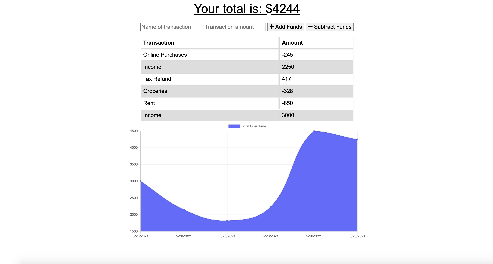

# Budget Tracker
A web application where users can enter budget-related information while offline.

## Description

This full-stack application utilizes back-end technologies such as Node.js, Express.js, Mongoose, and a Mongo database. On the front-end, the website uses HTML5, CSS3, JavaScript, and built-in browser capabilities such as IndexedDB. Users can enter deposits and expenses no matter if they are online or offline, and offline records are incorporated into the front-end graph when the user is back online again.

In building this application, I learned a lot more about IndexedDB and its capabilities. I also learned more about deploying with Heroku, since I ran into an application error even though the build was initially successful. Perhaps one of my favorite things that I learned is that using IndexedDB can be a fantastic way to enhance a user's experience since it can receive and save user inputs even without being connected to the website's back-end.

I enjoyed thinking through what each line of code is doing to power this web app, and I look forward to using IndexedDB/caching in other applications that I build in the future.

A few ideas for future development include:

- Adding update/delete functionality for each record in the database
- Creating options to set goals, then track budget goals weekly, monthly, and yearly
- Creating log in/log out functionality so that multiple users can use the app

## Technologies Used

- HTML5
- CSS3
- JavaScript
- Node.js
- Express.js
- NoSQL/MongoDB
- Mongoose

## Table of Contents

- [Installation](#Installation)
- [Usage](#Usage)
- [License](#License)
- [Contributing](#Contributing)
- [Tests](#Tests)
- [Questions](#Questions)
            
## Installation

The application can be viewed live on Heroku here: https://budget-tracker-1313.herokuapp.com/

For this application to run correctly on your local machine, run ```npm init -y ``` in the working directory of your choice. Next, install the relevant dependencies by running ```npm i```. Alternatively, you can install the dependencies one at a time. Please note that it may take a few minutes for all dependencies to download on your local machine.

You will need to make sure that the command ```mongod``` is running on your computer, whether that be in a separate Terminal window or if you have chosen the option to allow Mongo to run on your local machine at all times.

Run ```npm start``` to start the application. This application runs locally at port 3000.

A view of the dashboard:



## Usage

This application is intended to track deposits and expenses for one user.

## License

This project has not yet been licensed, and thus, standard copyright laws apply.
            
## Contributing

Valerie Russell is the sole contributor to this project. Starter code was provided by the MSU Coding Bootcamp/Trilogy Education Services.
            
## Tests

There are currently no tests written for this project.
            
## Questions

If you have any questions about this application my GitHub username is vruss14 and you can view my GitHub profile at https://github.com/vruss14.

If you have additional questions, feel free to reach out to me at vruss14@gmail.com.

